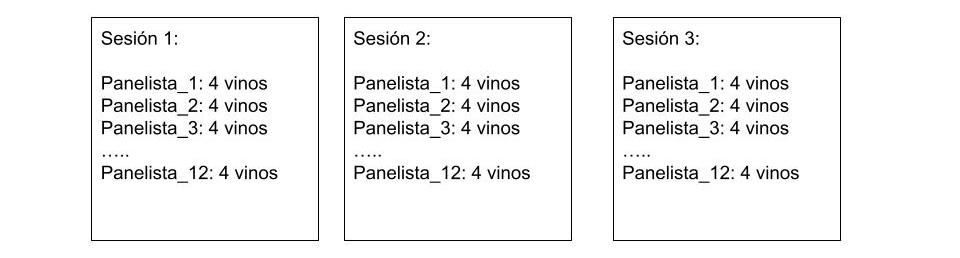

### Inntroducción 

Análisis sensorial de 4 vinos espumantes  




#### Hipótesis: Los panelistas pudieron diferenciar los vinos por el descriptor Untuoso
  
#### Diseño: DCA  
#### UE: panelista (n=12)  
#### VR: descriptor: Untuoso
#### Factores:   
####        vinos (fijo) ( 4 niveles) 
####        Panelista (aleatorio) (12 niveles) 
####        sesión (aleatorio)  ( 3 niveles) repeticiones
        


```{r echo=TRUE, message=FALSE, warning=FALSE}
library(readr)
library(tidyverse)
library(kableExtra)
data <- read_csv("data.csv")
data
```


```{r echo=TRUE}
kable(table(data$panelista, data$vino))
```

### Explorando los datos

```{r echo=TRUE, warning=FALSE}
data %>% 
  group_by(vino) %>%
 select(untuoso) %>%
  summarise_all(.funs = c(
    n = length, 
    ybar = mean, 
    sd = sd, 
    min = min, 
    max = max
    ))

summarize(data)
```


```{r echo=TRUE}
plot <-ggplot(data, aes(vino,data$untuoso))+
  geom_boxplot()
plot
```

##  Modelo

```{r echo=TRUE, message=FALSE, warning=FALSE}
library(lmerTest)
m1<- lmer(untuoso~vino
                  + (1 | panelista) 
                  + (1 | sesion)
                  + (1 | panelista:sesion)
                  + (1 | panelista:vino)
                  + (1 | sesion:vino), data=data)

anova(m1)
```
#supuestos

```{r echo=TRUE}
e<-resid(m1) 
pre<-predict(m1) #predichos
alfai<-ranef(m1)$panelista$'(Intercept)'

par(mfrow = c(1, 3))
plot(pre,e, xlab="Predichos", ylab="Residuos de pearson",main="Gr?fico de dispersi?n de RE vs PRED",cex.main=.8 )
abline(0,0)
qqnorm(e, cex.main=.8)
qqline(e)
qqnorm(alfai, cex.main=.8)
qqline(alfai)
shapiro.test(e)
shapiro.test(alfai)
```


#Comparaciones

```{r echo=TRUE}
library(emmeans)
library(multcomp)

lsd<-emmeans(m1,  pairwise~ vino)
lsd


#cld(lsd, adjust="tuckey", Letters = LETTERS)
plot(emmeans(m1, pairwise ~ vino))
```
# intervalos de confianza para la diferencia de medias

```{r echo=TRUE}
confint(emmeans(m1, pairwise ~ vino))
```
## Gráfico Final

```{r echo=TRUE}
comp1<-emmeans(m1, pairwise ~ vino)
resumen<-as.data.frame(comp1$emmeans)

ggplot(resumen, aes(x=vino, y=emmean)) + 
  geom_point(position=position_dodge(), stat="identity", fill="blue") + labs(y="Intensidad de durazno") +
  geom_errorbar(aes(ymin=emmean-SE, ymax=emmean+SE),                
                width=.2) 
 


```
# efectos aleatorios

```{r echo=TRUE}
summary(m1)
```

### Variabilidad debido a panelistas
```{r echo=TRUE}
VarT<-4.3136 + 0.1315+ 3.8883 
Var_P<-(4.3136/VarT)*100
Var_P


```

### Variabilidad debido a las sesiones
```{r}
Var_S<-(0.1315/VarT)*100
Var_S
```

```{r}
ranova(m1)
```

