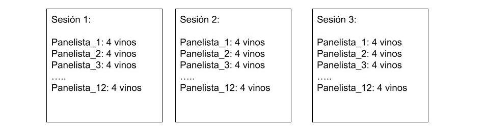

```{r message=FALSE, warning=FALSE, include=FALSE}
library(readr)
library(tidyverse)
library(kableExtra)
library(bookdown)

data <- read_csv("data.csv")

```


# Introducción 

Los vinos espumantes representan una pequeña pero significativa proporción de los vinos de la industria Argentina con una producción anual de 42500000 de litros. Existe una considerable diversidad entre los diferentes estilos, desde vinos espumantes muy frutados hasta aquellos que muestran una gran complejidad debido a la autólisis de levaduras y a la crianza [@Nevares2008]. Actualmente no se ha publicado ningún trabajo en el cual se realize un análisis sensorial de los vinos espumantes de Argentina.  
En este trabajo, la hipótesis es  que  Los panelistas van a poder diferenciar los vinos por el descriptor dulce. Se eligió este descriptor debido a que hay un amplio mercado para los vinos espumantes dulces.


# Objetivo


El presente trabajo busca caracterizar  sensorialmente los distintos estilos de los vinos espumantes argentinos.  


# Descrición de los datos empleados 

Los datos son parte de un trabajo pedido por Bodegas de Argentina para caracterizar los vinos espumantes Argentinos. Para obtener los datos se entrenó un panel de 12 personas yse utilizó la técnica sensorial QDA (Quantitative descriptive analysis) [@Lawless2010]. Se relizaron 8 sesiones de entrenamiento ne las culaes los panelistas llegaron a un consenso en los descriptores a evaluar y probaron los vinos por lo menos una vez. Como muestra la Figura 1 \@ref(fig:Figura1) , se realizaron tres sesiones de evaluación, en las cuales todos los panelistas probaron todos los vinos.


```{r Figura1, echo=FALSE,out.width="90%" ,fig.cap=" Esquema del diseño experimental"}

```

 A continuación se presentan las características del experimento: 

  
Diseño: DCA  
Unidad experimental: panelista (n=12)  
Variable respuesta: descriptor: dulce
Factores:   
vinos (fijo) ( 4 niveles) 
Panelista (aleatorio) (12 niveles) 
Sesión (aleatorio)  (3 niveles) repeticiones
        


En la Tabla  \@ref(tab:Tabla1)  Se muestra un ejemplo de la estructura de los datos.


```{r Tabla1 }
kable(data[1:50, c(1,2,3,20,21,22,23,24,25,26)], format = "latex",caption = "Fracción de los datos del Anaálisis sensorial de vinos espumantes") %>%
 kable_styling(font_size = 8)
```


```{r Tabla2 }
kable(table(data$panelista, data$vino),format = "latex",caption = "Frecuencia de evaluación de vinos por panelista")
```

En la Tabla    \@ref(tab:Tabla2)  se observa como tods los panelistas degustaron todas las muestras tres veces. 

# Descripción de la metodología

Los datos se analizaron utilizando un modelo de comparación de medias, incluyendo las tres interacciones . Los factores "sesión" y "panelista" se tomaron como aleatorios. Se utilizó un intervalo de diferencia de medias,  con un 95% de confianza,  para estimar la magnitud de la diferencia. Para el caso de los factores aleatorios,  se calcularon los coeficientes de correlación intraclase, se determinó la variabilidad entre panelistas y se realizó un análisis de la varianza para efectos aleatorios (Ranova) para determinar la interacción entre los factores. Para analizar los datos con modelos mixtos, se utiizó el paqueteL LmerTest [@Kuznetsova2017]. Los gráficos se realizaron con el paquete ggplot2 [@R-ggplot2]. 

# Resultados

## Estadística Descriptiva


Primeramente se calculó la media, la desviación estándar, el valor mínimo y el valor máimo de la variable respuesta.

```{r echo=TRUE, warning=FALSE}
data %>% 
  group_by(vino) %>%
 select(dulce) %>%
  summarise_all(.funs = c(
    n = length, 
    ybar = mean, 
    sd = sd, 
    min = min, 
    max = max
    ))

summarize(data)
```


Como muestra la Figura   \@ref(fig:Figura2) los datos de la copa 2 y de la copa 4 presentan cierta asimetría. También puede observarse la presencia de valores atípicos en la copa 1 y la copa 4.


```{r Figura2,fig.cap="Diagrama de cajas y bigotes de los 4 vinos"}
plot <-ggplot(data, aes(vino,data$dulce))+
  geom_boxplot()
plot


```


##  Modelo

El análisis de la varianza para la variable dulce indica que se rechaza la hipótesis nula y se acepta la  la hipótesis alternativa de que hay diferencias entra las medias con un nivel de significancia de 0.05.

```{r echo=TRUE, message=FALSE, warning=FALSE}
library(lmerTest)
m1<- lmer(dulce~vino
                  + (1 | panelista) 
                  + (1 | sesion)
                  + (1 | panelista:sesion)
                  + (1 | panelista:vino)
                  + (1 | sesion:vino), data=data)

anova(m1)
```

## Supuestos

Al comprobar los supuestos se observa que no se cumple el supuesto de normalidad dado que el  test de Shapiro dio un p-valor de 0.02. A pesar de esto se siguió con el análisis debido a que el ANOVA es robusto a la normalidad.

```{r echo=TRUE, message=FALSE, warning=FALSE}
e<-resid(m1) 
pre<-predict(m1) #predichos
alfai<-ranef(m1)$panelista$'(Intercept)'

par(mfrow = c(1, 3))
plot(pre,e, xlab="Predichos", ylab="Residuos de pearson",main="Gráfico de dispersión de RE vs PRED",cex.main=.8 )
abline(0,0)
qqnorm(e, cex.main=.8)
qqline(e)
qqnorm(alfai, cex.main=.8)
qqline(alfai)

```


```{r message=FALSE, warning=FALSE}
shapiro.test(e)
shapiro.test(alfai)
library(car)
 leveneTest(residuals(m1) ~ data$vino)
```


## Comparaciones

Al realizar los contrastes de la  comparación de medias con LSD se observa que el vino 3 se diferencia significativamente del resto de los vinos

```{r echo=TRUE, message=FALSE, warning=FALSE}
library(emmeans)
library(multcomp)

lsd<-emmeans(m1,  pairwise~ vino)
lsd


#cld(lsd, adjust="tuckey", Letters = LETTERS)

```

Al calcular los intervalos de confianza para la diferencia de medias, se observa que en promedio la diferencia entre  la copa 1 y la copa 3 está entre 1.95 y 5.24. La diferencia entre la copa 2 y la copa 3 está entre 1.71 y 5. Por último la diferencia entre al copa 3 y la copa 4 está, en promedio,  entre 2.32 y 5.61. En todos los casos, la magnitud de la diferencia se considera técnicamente importante.


## Intervalos de confianza para la diferencia de medias

```{r echo=TRUE}
confint(emmeans(m1, pairwise ~ vino))
```

## Gráfico de medias

```{r Figura3, fig.cap="Gráfico final del modelo", echo=TRUE, message=FALSE, warning=FALSE}
comp1<-emmeans(m1, pairwise ~ vino)
resumen<-as.data.frame(comp1$emmeans)

plot2<-ggplot(resumen, aes(x=vino, y=emmean)) + 
  geom_point(position=position_dodge(), stat="identity", fill="blue") + labs(y="Intensidad de dulce") +
  geom_errorbar(aes(ymin=emmean-SE, ymax=emmean+SE),                
                width=.2) 
plot2


```

La Figura  \@ref(fig:Figura3) muestra las medias y las desviaciones estándars estimadas por el modelo. Puede observarse que la copa 3 fue percibida por los panelistas como la compa más dulce

## Efectos aleatorios

En cuanto a los efectos aleatorios, se observa que los panelistas fueron los que mayor varianza tuvieron (4.8749). Por otro lado se observa que la variablidad debido a las sesiones es despreciable. Para indagar más en la variabilidad de los efectos aleatorios se calcularon los coeficientes de correlación intraclase para los panelistas y para las sesiones. Dicho oeficiente es del 50% para los panelistas. Dicha situación que es bastante común para los paneles entrenados.

```{r echo=TRUE}
summary(m1)
```

##  Componentes de varianza
### Coeficientes de correlación intraclase_panelista

```{r echo=TRUE}
VarT<-4.3136 + 0.1315+ 3.8883 
Var_P<-(4.3136/VarT)*100
Var_P


```

#### Coeficientes de correlación intraclase_sesion

```{r}
Var_S<-(0.1315/VarT)*100
Var_S
```


### Variabilidad entre panelistas

La Figura  \@ref(fig:Figura4) muestra la variablidad entre panelistas. Se observa que la panelista Vera fue la que más se separó del resto de los panelistas.  

```{r , Figura4, fig.cap="Variabiliad entre panelistas", message=FALSE, warning=FALSE}
a<-ranef(m1) 
a$panelista$`(Intercept)`
a$sesion$`(Intercept)`
library(sjPlot)
library(sjlabelled)
library(sjmisc)
c<-plot_model(m1, type="re", show.values = TRUE, value.offset = .3)
c[[4]]
```

## Anova de efectos aleatorios

Finalmente se realiza una análisis de la varianza de efectos aleatorios (ranova) para observar la significancia de las interacciones. Se observa que ninguna interacción fue significativa mostrando un buen entrenamiento del panel y buena repetición entre sesiones.

```{r message=FALSE, warning=FALSE}
ranova(m1)
```

# Discusión y  Conclusiones

En base a los resultados mostrados se concluye que los panelistas pudieron diferencias los vinos por el gusto dulce. El vino que fue percibido como más dulce fue el vino 3.En todos los contrastes las magnitudes de las diferencias resultaron técnicamente importantes.
Debido a que no hubo interacciones  [@Varela2014] podemos concluir que el panel estuvo bien entrenado para el descriptor dulce.

# Bibliografía


